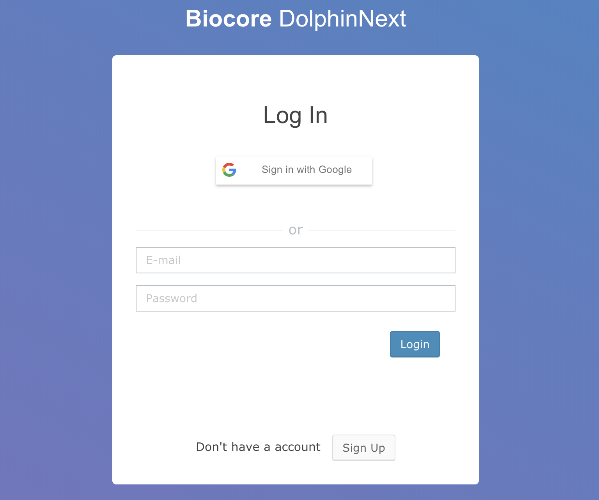
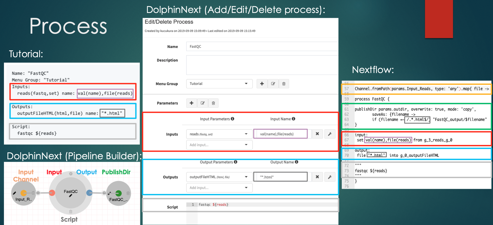
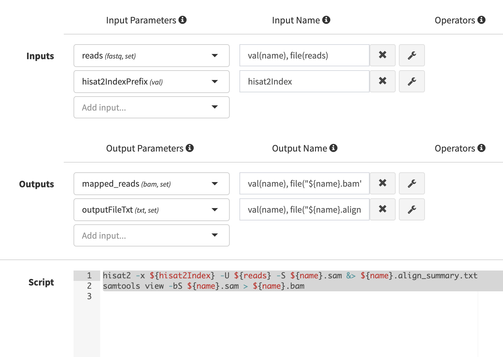
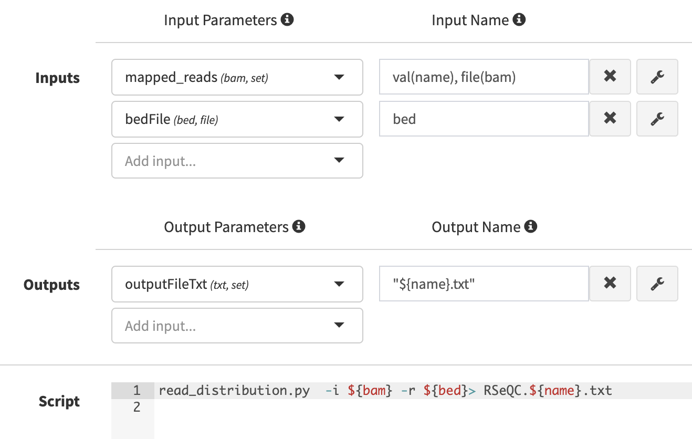
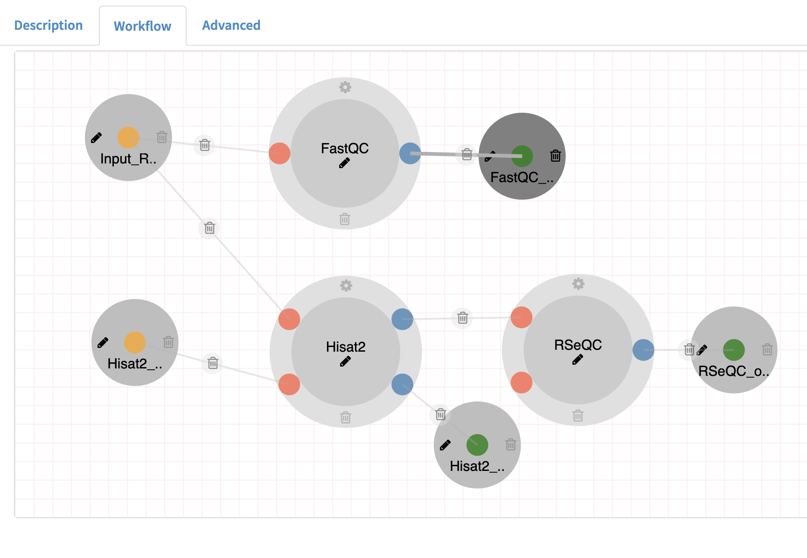
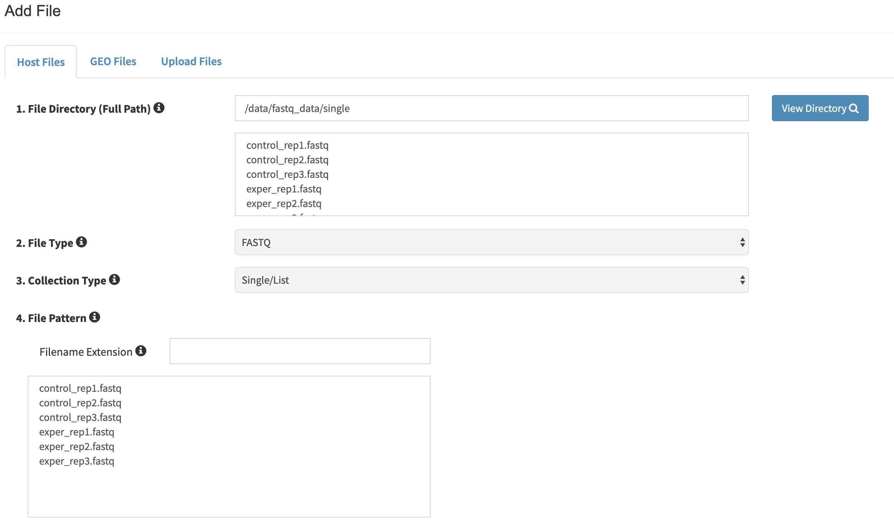
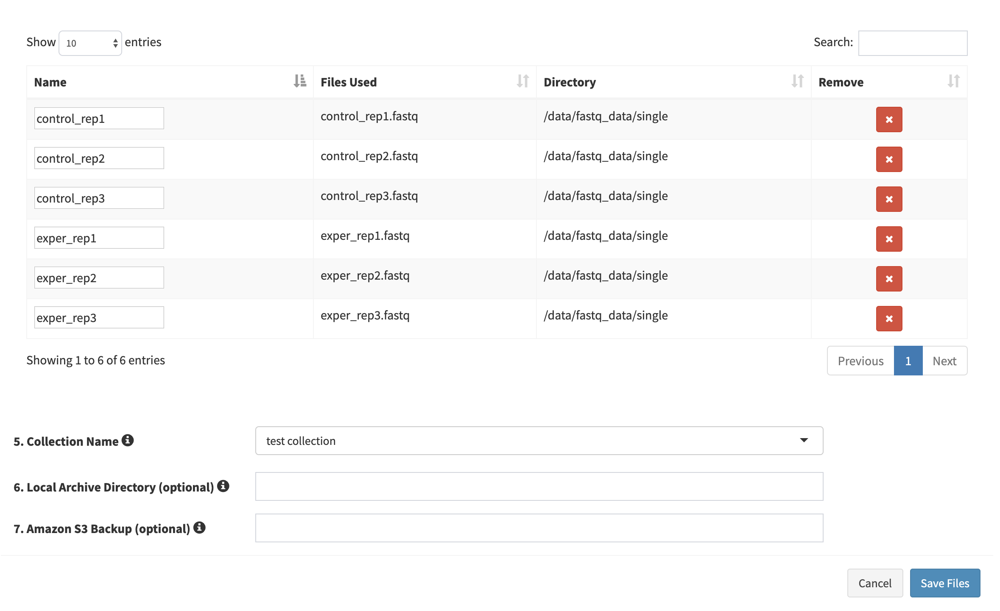
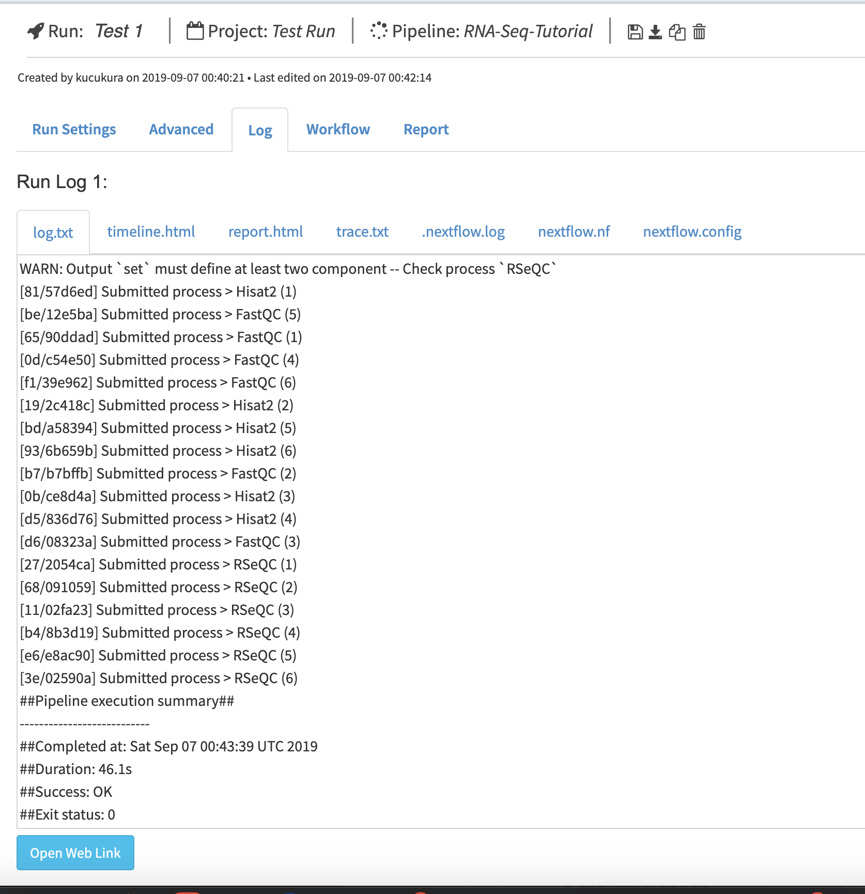
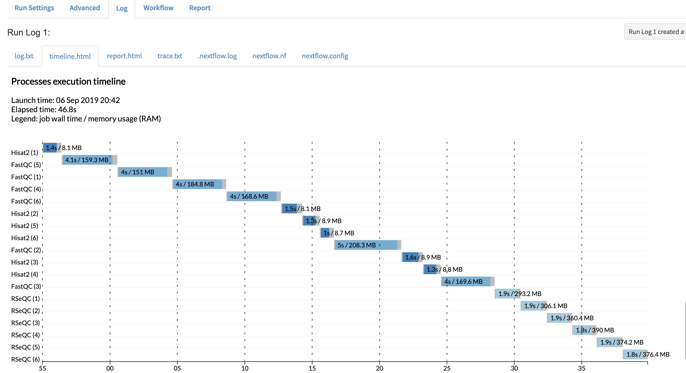
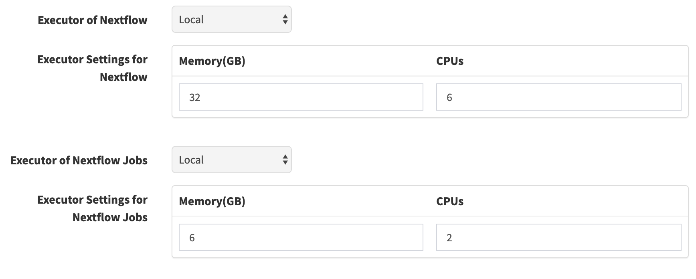

Introduction
========

DolphinNext is an easy-to-use platform for creating, deploying, and executing complex nextflow pipelines for high throughput data processing.

DolphinNext provides: 
--------

1. A drag and drop user interface to build nextflow pipelines
2. Reproducible pipelines with version tracking 
3. Seamless portability to different computing environments with containerization
4. Simplified pipeline sharing using GitHub (github.com)
5. Support for continuous integration and tests (travis-ci.org)
6. Easy re-execution of pipelines by copying previous runs settings
7. Integrated data analysis and reporting interface with R markdown support

Summary
========

Our aim is;
--------

1. Reusability
2. Reproducibility
3. Shareability
4. Easy execution
5. Easy monitoring
6. Easy reporting


Expected learning outcome
========

To understand the basics of DolphinNext, how to use pipeline builder for different objectives and to familiarize yourself with some standard software packages for such analysis.


Before you start
========

DolphinNext docker version
--------

DolphinNext can be run standalone using a docker container.
First docker image need to be build unless you want to use prebuild from dockerhub. So, any change in the Dockerfile requires to build the image. But in this tutorial, we will pull it and start the container.

  * Note: If you don't have docker installed, please go to http://dolphinnext.umassmed.edu and let us know about it (biocore@umassmed.edu). We will set an account for you.

Pull the docker image
---------

1. Pull DolphinNext-studio
```   
docker pull ummsbiocore/dolphinnext-studio
```

Start the container
---------

1. We move database outside of the container to be able to keep the changes in the database every time you start the container.
Please choose a directory in your machine to mount. For example, I will use ~/export directory for this purpose.
```
sudo mkdir -p ~/export
```
2. While running the container;
```
docker run --privileged -m 10G -p 8080:80 -v ~/export:/export -ti ummsbiocore/dolphinnext-studio /bin/bash
```
3. After you start the container, you need to start the mysql and apache server using the command below;
```
startup
```
4. Now, you can open your browser to access DolphinNext using the url below.

http://localhost:8080/dolphinnext

Tutorial guide
==============

This guide will walk you through how to start using DolphinNext pipelines and creating new pipelines.

Short Overview
==============

[](https://youtu.be/1ak1m5pvkw4)


Getting Started
===============

First, you need to access DolphinNext web page: https://localhost:8080/dolphinnext and click **Sign Up** or **Sign in with Google** buttons. You will be asked to enter some information about your institution, username, etc. 




Once you login, you will be the administrator of this mirror. You can add more users to your system and manage them from profile/admin section.


Exercise 1 (Creating processes)
===============

[](https://youtu.be/d6jkg1l7FgA)

Once logged in, click on the pipeline tab in the top left of the screen to access pipeline builder page. 


**What is a "process"?**
------------------
Process is a basic programming element in nextflow to run user scripts. It usually have input, output parameters and script section. In this tutorial, you will see necesseary information to define a process shown in the left side of picture below. All that information need to be filled in "Add new process" screen shown in the middle in the picture below. DolphinNext will than convert this information to a nextflow process shown in the left side of the picture. Once a process created, it can be used in the pipeline builder. The example how it looks is shown in bottom left side in the picture. The mapping between the sections shown in colored rectangles.      



The process we will create in this exercise;
---------------
1. FastQC process
2. Hisat2 process
3. RSeQC process

You’ll notice several buttons at the left menu. New processes are created by clicking green “New process” button.

  **1. FastQC process**:
------------------------
**a.** Please enter FastQC for the process name and define a new "Menu Group". We will add the processes into this group in the sidebar.


**b.** In the FastQC process, we have an input, an output and a line of a command we are going to use to execute the fastqc process. 

```
Name: "FastQC"
Menu Group: "Tutorial"
Inputs: 
  reads(fastq,set) name: val(name),file(reads)
  
Outputs: 
  outputFileHTML(html,file) name: "*.html"
  
Script:
  fastqc ${reads}
```

**c.** Let's add input and output parameters (`reads` and `outputFileHTML`) using "+" button in "Parameters" section:

   
   

**d.** After both parameters created. Lets select them and define their "Input Names" that we are going to use in the script section


 
**e.** Let's enter the script section


**f.** Press "Save changes" button at the bottom of the modal to create the process. Now this process is ready to use. We will use it in the Exercise 2.

  **2. Hisat2 process**:
------------------------
Let's create Hisat2 process. 

**a.** First, please click, green “New process” button to open "Add New Process" modal.

**b.** Inputs, outputs and scripts should be defined like below;
Please add `hisat2IndexPrefix`, `mapped_reads` and `outputFileTxt` parameters by pressing "+" button next to "Parameters" section with the values below; 

```
Name: "Hisat2"
Menu Group: "Tutorial"
Inputs: 
  reads(fastq,set) name: val(name),file(reads)
  hisat2IndexPrefix(val) name: hisat2Index
      
Outputs: 
  mapped_reads(bam,set) name: val(name), file("${name}.bam")
  outputFileTxt(txt,file) name: "${name}.align_summary.txt"

Script:
  hisat2 -x ${hisat2Index} -U ${reads} -S ${name}.sam &> ${name}.align_summary.txt
  samtools view -bS ${name}.sam > ${name}.bam

```
**c.** Add hisat2IndexPrefix parameter;


**d.** Add mapped_reads parameter;


**e.** Add outputFileTxt parameter;


**f.** After you select input output parameters, add their names and enter the script. The page should look like this;



**g.** Please save changes before you close the screen.

  **3. RSeQC process**:
-----------------------

**a.** First, please click, green “New process” button to open "Add New Process" modal.

**b.** The form should be filled using the values below;
Please add a new parameter called bedFile. 

```
Name: "RSeQC"
Menu Group: "Tutorial"
Inputs: 
  mapped_reads(bam,set) name: val(name), file(bam)
  bedFile(bed,file) name: bed
  
Outputs: 
  outputFileTxt(txt,file) name: "RSeQC.${name}.txt"
  
Script:
  read_distribution.py  -i ${bam} -r ${bed}> RSeQC.${name}.txt
```

**c.** Add bedFile parameter;


**d.** After you select input output parameters, add their names and enter the script. The page should look like this;



**g.** Please, Save changes before you close the screen.

Here Exercise 1 is finished. Please move to Exercise 2 to build the pipeline using the processes you defined in Exercise 1. 

Exercise 2 (Building a pipeline)
===============

Once logged in, click on the pipeline button in the top left of the screen. You’ll notice Enter Pipeline Name box, just below the Pipelines button.

Note*: If you could not finish the Exercise 1. Please import the tutorial.dn file using your pipeline builder and the processes defined in Exercise 1 will be in your left menu that you can use then while doing Exercise 2.

Before you start building the pipeline make sure you have the processes available in your menu.


**a.** Please enter a name to your pipeline. E.g. "RNA-Seq-Tutorial" and select your menu group "public pipelines" and press save button.

**b.** Please drag and drop FastQC, Hisat2 and RSeQC to the workspace;


**c.** Please drag and drop three Input parameters and change their names to "Input_Reads", "Hisat2_Index" and "bedFile" and connect them to their processes;     

**d.** Connect your Hisat2 process with RSeQC process using mapped_reads parameter in both. You will see that, if the types match you can connect the two processes.

**e.** Drag & Drop three output parameters and name them "FastQC_output", "Hisat2_Summary", and "RSeQC_output" and connect them to their corresponding processes. While naming, click their "Publish to Web Directory" and choose the right output format according to the output type of the process.
 


**f.** Overall pipeline should look like below;


 
Exercise 3 (Executing a pipeline)
===============

[](https://youtu.be/gaq_LwewFPA)

  **1.** Once a pipeline is created, you will notice “Run” button at the right top of the page.


  **2.** This button opens a new window where you can create a new project by clicking “Create a Project” button. After entering and saving the name of the project, it will be added to your project list. 


  **3.** Now you can select your project by clicking on the project.
You will then proceed by entering run name which will be added to your run list of the project. Clicking “Save run” will redirect you to the “run page” where you can initiate your run.


  **4.** Here, please enter your working directory, choose your "Run Environment", click "Use Singularity Image" and enter the values below;
```
Work Directory: /export/tests/test1
Run Environment: Local
Image Path: dolphinnext/rnaseq:1.0
Run Options: --bind /export --bind /data
```  


  **5.** Now we are ready to enter inputs we defined for the pipeline;
First enter the location of the bed file.
```
bedFile: /data/genome_data/mousetest/mm10/refseq_170804/genes/genes.bed
```


  **6.** Second enter the prefix for the hisat2 index files.
```
Hisat2_Index: /data/genome_data/mousetest/mm10/refseq_170804/Hisat2Index/genome
```


  **7.** Now, we are ready to enter adding files;
First go to Files Tab in "Select/Add Input File" modal and click "Add File" button


  **8.** Enter the full path of the location of your files. Here for the test case we will use the path below;
```
File Directory (Full Path): /data/fastq_data/single
```
And choose "Single List" for the "Collection Type" and press add all files button.



  **9.** Here there is an option to change the names but we will keep them as they are and enter a collection name and "save files".
```
collection name: test collection
```


  **10.** In the next screen, the user can still add or remove some samples. Let's click "Save file" button to process all samples.


  **11.** After we fill the inputs it should look like below and the orange "Waiting" button at the top right should turn to green "Ready to Run" button;


  **12.** Press that "Ready to Run" button.

  **13.** All run should finish in a couple of minutes. When the run finalized the log section will be look like below;

  **a. Logs**:



  **b. Timeline**:


  **c. Nextflow Reports**:


  **14.** In the report section, you can monitor all defined reports in the pipeline;


  **a. FastQC**


  **b. Hisat2**


  **c. RSeQC**


  **15.** As you can tell from Timeline report, it used only a cpu and it didn't parallelize the run. To be able to start parallel runs, the profile for the environment should be changed.



With this change there will be 3 parallel jobs.


